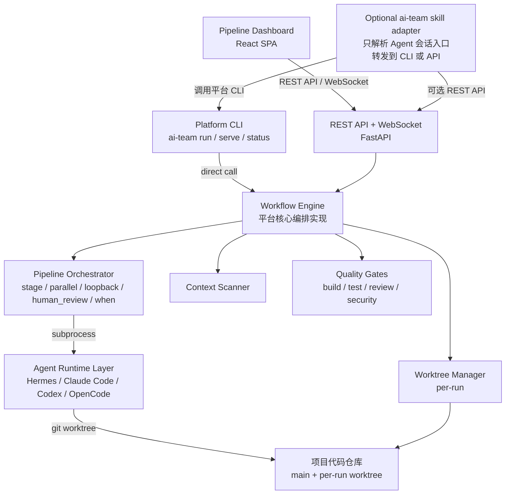

# AI Team Platform — 需求规格说明书 (Spec)

> 版本: 2.1 | 日期: 2026-04-25 | 状态: Draft
> 变更: 明确平台独立边界，`ai-team` skill 降级为可选兼容入口，平台仓库成为唯一核心实现归属

---

## 1. 项目愿景

**一句话：说一个需求，交付一个可上线的版本。**

不是 demo，不是 prototype，不是中看不中用的 POC。而是经过方案设计、代码实现、自动化测试、代码审查、质量门禁后，可以真正合并到主分支的交付物。

### 1.1 核心判断

当前 ai-team 的瓶颈**不是基础设施不足**（没有 PostgreSQL/没有 WebSocket/没有看板），而是**质量问题**：

1. Agent 不理解项目现有代码（无 codebase context injection）
2. 开发完没有自动跑测试验证（test → fix 循环缺失）
3. 代码审查反馈无法自动回流修改代码（loopback 太粗糙）
4. Agent prompt 太泛，没有针对项目定制

**先解决质量问题，再解决工程问题。** 基础设施（持久化、WebSocket、前端）在质量验证通过后再建设。

### 1.2 项目定位

将 `ai-team` 从一个安装在 Agent 环境里的 skill，演进为一个独立的 **AI Team Platform**：
- 核心是平台仓库内的 **Workflow Engine**，而不是 `~/.agents/skills/ai-team` 里的脚本
- CLI、API、Web 面板都调用同一套平台引擎
- 现有 `ai-team` skill 只保留为可选兼容入口：负责把 Agent 会话中的自然语言请求转发给平台 CLI/API，不再承载核心编排实现
- 当前 skill 中已验证有价值的逻辑可以迁移/抽取到平台，但迁移完成后不得形成 skill runner 与平台 engine 双实现
- 前端是自建轻量面板，专为 pipeline 监控设计
- 不依赖任何第三方平台（如 Multica）

### 1.3 使用方式

平台实现后，推荐入口按优先级为：

1. **Web 面板**：适合查看 pipeline、实时输出、历史记录和人工验收。
2. **平台 CLI**：适合本地开发和自动化脚本，例如 `ai-team run --spec docs/spec.md --project /path/to/repo`。
3. **REST API / WebSocket**：适合外部系统集成。
4. **`ai-team` skill 兼容入口**：适合在 Codex/Claude/OpenCode 等 Agent 会话里用一句话触发平台，不是平台运行的必要依赖。

因此，平台完成后，用户不需要安装 `ai-team` skill 也能使用完整能力；skill 只是 Agent 生态里的轻量适配层。

---

## 2. 核心设计决策

### 2.1 技术选型

| 层级 | 技术 | 理由 |
|------|------|------|
| 编排引擎 | Python 3.11+ | 迁移/抽取现有 ai-team runner 中已验证逻辑，但核心实现落在平台仓库 |
| HTTP 服务 | FastAPI | 原生 async、WebSocket、自动 API 文档 |
| 数据库 | PostgreSQL 17 | 并发写入、后续扩展无技术债 |
| 前端 | React + Tailwind + shadcn/ui | 轻量、组件丰富、pipeline 场景够用 |
| 实时通信 | WebSocket (FastAPI) | agent 执行可能 30 分钟，轮询不合适 |
| 代码隔离 | Git Worktree | per-run 隔离，develop + verify 共享同一 worktree |
| 部署 | Docker Compose | Engine + PostgreSQL + 前端 |
| 兼容入口 | `ai-team` skill adapter | 可选安装，只转发到平台 CLI/API，不复制核心编排逻辑 |

**为什么不用 Multica？**
- Multica 是通用看板系统，Issue/Agent/Project 模型与 pipeline/run/stage 概念是强行映射
- API 不稳定（几天一版），集成维护成本高
- 个人/小团队场景下，一个专门的 pipeline 面板比通用看板更合适
- 技术栈统一（Python 全栈），不引入 Go 生态

### 2.2 架构原则

1. **平台仓库是唯一核心实现归属** — `engine/`、`api/`、`cli/`、`web/` 都在 `/Users/wurui/IdeaProjects/ai-team-platform` 内演进
2. **引擎是核心，入口是可替换项** — Web、CLI、API、skill adapter 都只是入口，不各自实现编排逻辑
3. **质量优先于工程** — Phase 0 先证明"pipeline 能交付好代码"，再建持久化和前端
4. **产物即状态** — 文件系统的产物契约保持不变，持久化层在文件之上叠加
5. **Agent 是可替换的执行单元** — Hermes、Claude Code、Codex 通过统一接口调用
6. **渐进式迁移，不长期双写** — 允许从当前 skill runner 迁移能力，但 Phase 0 结束后不得保留两套核心 runner
7. **渐进式演进** — 每个 Phase 独立可用，不依赖后续 Phase

---

## 3. 系统架构



---

## 4. 功能需求

### 4.1 Phase 0：质量优先（核心阶段）

> 目标：让单次需求的交付质量从"demo 级"提升到"可合并"级别。
> 工期：3-5 周。按串行执行约 5 周；按任务 1/2/4 并行、任务 3/5 在基础引擎稳定后交错推进，可压缩到 3-4 周。

#### 4.1.1 Codebase Context Scanner

**问题**：当前 tech-lead agent 拿到的只有 requirement + solution-draft.md，完全不知道项目现有代码长什么样。这是 demo 级交付的根本原因——agent 在"盲写"。

**方案**：在 develop 阶段开始前，自动扫描项目并生成上下文摘要，注入到 agent prompt 中。

**扫描内容**：

```
1. 项目结构（目录树，排除 node_modules/.git/build 等）
2. 框架识别（SwiftUI / Next.js / Spring Boot 等）
3. 依赖清单（Package.swift / package.json / pom.xml 等）
4. 编码规范（.swiftlint.yml / .eslintrc / .editorconfig 等）
5. 关键文件内容：
   - 入口文件（App.swift / main.ts / Application.java）
   - 数据模型（Models/ / models/ / domain/）
   - 路由/API 定义
   - 现有测试文件（了解测试风格）
6. 最近变更（git log --oneline -20）
```

**注入策略**：

- 方案阶段（plan/architect）：注入项目结构 + 框架识别 + 最近变更
- 开发阶段（develop）：注入上述全部 + 相关文件内容
- 审查阶段（verify）：注入变更文件 diff + 相关上下文

**配置**：

```yaml
context_scanner:
  enabled: true
  # 需要排除的目录
  exclude_dirs:
    - node_modules
    - .git
    - build
    - .build
    - DerivedData
    - Pods
  # 最大注入文件大小（字符数），超过则截断
  max_file_size: 50000
  # 需要扫描的文件 glob 模式
  include_patterns:
    - "**/*.swift"
    - "**/*.ts"
    - "**/*.tsx"
    - "**/*.py"
    - "**/Package.swift"
    - "**/package.json"
    - "**/*.md"  # README / CHANGELOG
  # 关键文件（始终注入完整内容）
  key_files:
    - "AGENTS.md"
    - "CLAUDE.md"
    - ".swiftlint.yml"
    - ".eslintrc.*"
```

**实现**：平台模块 `engine/context_scanner.py`，被 orchestrator 在每个阶段开始时调用。现有 skill 里的 `context_scanner.py` 可作为迁移来源，但迁移完成后平台模块是唯一维护对象。

#### 4.1.2 Worktree Manager

**问题**：当前 ai-team 所有 agent 在同一个工作目录操作，多 Agent 并行必然冲突。而且直接在 main 分支改代码，失败后需要手动回滚。

**方案**：per-run worktree 隔离。

**核心逻辑**：

```
1. pipeline run 开始时：
   - 基于 main 分支创建一个 worktree: .ai/worktrees/<run-id>/
   - plan/architect 阶段不需要 worktree（只读项目）

2. develop 阶段：
   - 在 worktree 中执行
   - agent 的 cwd 设为 worktree 路径

3. verify 阶段（QA / Code Reviewer）：
   - 在同一个 worktree 中执行
   - reviewer 看到的是 developer 的实际产出（不是 main 分支的干净代码）
   - quality gates（编译/测试）也在 worktree 中执行

4. pipeline 全部通过后：
   - squash merge worktree → main
   - 清理 worktree

5. pipeline 失败/取消时：
   - 清理 worktree（不合并）
   - main 分支不受影响
```

**为什么是 per-run 而不是 per-stage**：

- per-stage（我之前的方案）有逻辑缺陷：develop 和 verify 在不同 worktree，reviewer 看不到 developer 的代码
- per-run 让 develop + verify 共享同一个 worktree，审查的是真实产出
- plan/architect 不改代码，不需要 worktree

**合并策略**：

```yaml
worktree:
  enabled: true
  strategy: "per-run"           # 一个 pipeline run 一个 worktree
  base_branch: "main"
  merge_strategy: "squash"      # squash | merge-commit
  auto_cleanup: true            # pipeline 结束后自动清理
  merge_on_conflict: "pause"    # pause (暂停等人工) | abort (直接失败)
```

**异常处理**：
- 合并冲突：暂停 pipeline，输出冲突文件列表，等待人工解决后 resume
- 引擎崩溃重启：检测残留 worktree，提供 `ai-team cleanup` 命令
- 磁盘空间不足：合并前检查，不足时 fail-fast

#### 4.1.3 Quality Gates（简化版）+ Test-Fix 循环

**问题**：当前 pipeline 是线性的——develop 失败就停，测试失败也直接停。没有自动修复循环。

**方案**：在 develop 阶段之后、verify 阶段之前，插入质量门禁 + 自动重试循环。

**执行流程**：

```
develop 阶段完成
    │
    ▼
Quality Gate 1: 编译 (swift build / npm run build)
    │
    ├── 通过 → 继续
    │
    └── 失败 → 把编译错误注入 developer agent prompt → 重试 develop
                │
                ├── 重试成功 → 回到 Quality Gate 1
                │
                └── 超过 max_retries → pipeline 失败，报告错误
    │
    ▼
Quality Gate 2: 测试 (swift test / npm test)
    │
    ├── 通过 → 继续
    │
    └── 失败 → 把测试失败输出注入 developer agent prompt → 重试 develop
                │
                ├── 重试成功 → 回到 Quality Gate 2
                │
                └── 超过 max_retries → pipeline 失败，报告错误
    │
    ▼
verify 阶段 (QA + Code Reviewer)
```

**配置**：

```yaml
quality_gates:
  - name: "编译通过"
    type: command
    command: "swift build -c debug"
    required: true                    # 失败则阻断
    max_retries: 3                    # 自动重试次数
    retry_stage: "develop"            # 重试哪个阶段

  - name: "单元测试"
    type: command
    command: "swift test --parallel"
    required: true
    max_retries: 3
    retry_stage: "develop"

  - name: "代码覆盖率 > 80%"
    type: threshold
    command: "swift test --coverage"
    parse: "regex:Total coverage: ([\\d.]+)%"
    threshold: 80
    operator: ">="
    required: false                   # 不通过只警告，不阻断
    max_retries: 1

  - name: "安全扫描"
    type: command
    command: "tirith scan ."
    required: true
    max_retries: 1
```

**重试机制**：

重试时，把以下信息注入到 developer agent 的 prompt 中：

```markdown
## 质量门禁失败反馈（第 N 次重试）

### 失败门禁：编译通过
### 命令：swift build -c debug
### 错误输出：
```
<actual error output>
```
### 请修复以上错误后重新提交。
```

这与现有 loopback 机制类似，但 loopback 是 verify 阶段触发回到 develop，而 quality_gates 是 develop 阶段之后立即触发。两者共存不冲突。

#### 4.1.4 Agent Prompt 增强

**问题**：所有 agent 用通用 prompt，没有项目级定制。

**方案**：在现有 agent prompt 基础上，通过项目级配置增强关键行为。

**solution-architect 增强**：

```markdown
## 输出要求（增强）
你的方案必须包含一个"实施清单"章节：
- 需要修改的文件列表（路径 + 修改原因）
- 需要新建的文件列表（路径 + 职责）
- 需要修改的配置/依赖
- 预估影响范围（哪些模块会受影响）
```

**tech-lead 增强**：

```markdown
## 工作流程（增强）
1. 先阅读实施清单中列出的文件，理解现有代码
2. 按实施清单逐文件修改，不要跳过
3. 每个文件修改后，说明修改内容
4. 全部修改完成后，运行验证命令确认编译通过
5. 如果编译失败，根据错误信息修复

## 证据要求（增强）
- 必须列出每个修改的文件及其变更摘要
- 必须说明验证命令的实际输出
```

**code-reviewer 增强**：

```markdown
## 审查增强
- 检查实施清单中的所有文件是否都已修改
- 检查修改是否符合项目编码规范（参考注入的 lint 配置）
- 检查是否有遗漏的边界场景
- 如果存在"假设已修改但实际未修改"的结论，标记为 Critical
```

**配置方式**：

项目级 `.ai/agents/` 目录下的 prompt 文件会覆盖平台内置默认 prompt：

```
项目根目录/
  .ai/
    team.yaml
    agents/
      tech-lead.md        # 覆盖默认 tech-lead prompt
      code-reviewer.md    # 覆盖默认 code-reviewer prompt
```

prompt 解析优先级：
1. 项目 `.ai/agents/<name>.md`（项目级定制）
2. team.yaml 中 `prompt:` 指定的路径
3. 平台内置模板目录 `templates/agents/<name>.md`
4. 兼容期才允许回退到 `~/.agents/skills/ai-team/agents/<name>.md`，仅用于用户曾经手动修改过本机 skill prompt、且平台模板缺失同名 prompt 的迁移场景；触发时必须输出 deprecation warning

兼容期退出条件：Phase 0 验收通过后，平台 `templates/agents/` 必须覆盖默认团队所需 prompt；随后移除第 4 级回退。长期规则是平台不能依赖 skill 才能找到默认 prompt；skill prompt 只作为迁移期兼容来源。

#### 4.1.5 简单 API（无持久化）

**问题**：纯 CLI 无法被外部系统（如后续的前端）调用。

**方案**：提供一个极简 FastAPI 服务，只做"触发运行 + 查看状态 + 获取产物"，不持久化。

**API 端点**：

```
POST   /api/runs                    # 触发 pipeline 执行
  Body: { "requirement": "...", "workdir": "/path/to/project" }
  Response: { "run_id": "...", "output_dir": "..." }

GET    /api/runs                    # 列出正在运行的 pipeline
  Response: [{ "run_id": "...", "status": "running", "pipeline": "..." }]

GET    /api/runs/{id}               # 获取执行状态（从文件系统读取）
  Response: { "status": "...", "stages": [...], "artifacts": [...] }

GET    /api/runs/{id}/artifacts     # 列出产物文件
GET    /api/runs/{id}/artifacts/{file}  # 下载产物文件

WS     /ws/runs/{id}                # 实时输出流
```

**实现要点**：
- 状态从文件系统读取（`.ai/team-output/*/report.json`），不依赖数据库
- WebSocket 推送 agent 实时输出（迁移现有 runner 的流式输出逻辑）
- `ai-team serve` 命令启动平台服务；skill adapter 如存在，也只是调用该命令

---

### 4.2 Phase 1：持久化 + 前端面板

> 目标：pipeline 执行可观察、可管理、可追溯。
> 工期：2-3 周

#### 4.2.1 PostgreSQL 持久化

**数据模型**：

```sql
-- Pipeline 定义
CREATE TABLE pipeline (
    id UUID PRIMARY KEY DEFAULT gen_random_uuid(),
    name TEXT NOT NULL,
    description TEXT,
    project_path TEXT NOT NULL,
    config JSONB NOT NULL,          -- 完整的 team.yaml 内容
    version INT NOT NULL DEFAULT 1,
    created_at TIMESTAMPTZ NOT NULL DEFAULT now(),
    updated_at TIMESTAMPTZ NOT NULL DEFAULT now()
);

-- Pipeline 版本历史
CREATE TABLE pipeline_version (
    id UUID PRIMARY KEY DEFAULT gen_random_uuid(),
    pipeline_id UUID NOT NULL REFERENCES pipeline(id) ON DELETE CASCADE,
    version INT NOT NULL,
    config JSONB NOT NULL,
    created_at TIMESTAMPTZ NOT NULL DEFAULT now(),
    UNIQUE(pipeline_id, version)
);

-- Pipeline 执行实例
CREATE TABLE pipeline_run (
    id UUID PRIMARY KEY DEFAULT gen_random_uuid(),
    pipeline_id UUID REFERENCES pipeline(id),
    status TEXT NOT NULL DEFAULT 'pending'
        CHECK (status IN ('pending', 'running', 'completed', 'failed', 'cancelled')),
    project_root TEXT NOT NULL,
    main_branch TEXT NOT NULL DEFAULT 'main',
    requirement TEXT,
    trigger_source TEXT NOT NULL DEFAULT 'manual'
        CHECK (trigger_source IN ('manual', 'api', 'webhook')),
    worktree_path TEXT,
    context JSONB NOT NULL DEFAULT '{}',
    error_message TEXT,
    started_at TIMESTAMPTZ,
    completed_at TIMESTAMPTZ,
    created_at TIMESTAMPTZ NOT NULL DEFAULT now(),
    duration_seconds FLOAT
);

-- 阶段执行实例
CREATE TABLE stage_run (
    id UUID PRIMARY KEY DEFAULT gen_random_uuid(),
    pipeline_run_id UUID NOT NULL REFERENCES pipeline_run(id) ON DELETE CASCADE,
    stage_id TEXT NOT NULL,
    stage_name TEXT NOT NULL,
    iteration INT NOT NULL DEFAULT 1,
    status TEXT NOT NULL DEFAULT 'pending'
        CHECK (status IN ('pending', 'running', 'completed', 'failed', 'skipped', 'cancelled')),
    is_parallel BOOLEAN NOT NULL DEFAULT false,
    loopback_from TEXT,
    error_message TEXT,
    started_at TIMESTAMPTZ,
    completed_at TIMESTAMPTZ,
    duration_seconds FLOAT,
    output_dir TEXT,
    UNIQUE(pipeline_run_id, stage_id, iteration)
);

-- Agent 执行实例
CREATE TABLE agent_run (
    id UUID PRIMARY KEY DEFAULT gen_random_uuid(),
    stage_run_id UUID NOT NULL REFERENCES stage_run(id) ON DELETE CASCADE,
    agent_name TEXT NOT NULL,
    provider TEXT NOT NULL,
    role TEXT,
    status TEXT NOT NULL DEFAULT 'pending'
        CHECK (status IN ('pending', 'running', 'completed', 'failed', 'timeout', 'cancelled')),
    output_file TEXT,
    raw_log_file TEXT,
    exit_code INT,
    error_message TEXT,
    started_at TIMESTAMPTZ,
    completed_at TIMESTAMPTZ,
    duration_seconds FLOAT
);

-- 质量门禁执行记录
CREATE TABLE quality_gate_run (
    id UUID PRIMARY KEY DEFAULT gen_random_uuid(),
    stage_run_id UUID NOT NULL REFERENCES stage_run(id) ON DELETE CASCADE,
    gate_name TEXT NOT NULL,
    gate_type TEXT NOT NULL,
    status TEXT NOT NULL DEFAULT 'pending'
        CHECK (status IN ('pending', 'running', 'passed', 'failed', 'skipped')),
    command TEXT,
    exit_code INT,
    output TEXT,
    required BOOLEAN NOT NULL DEFAULT true,
    retry_count INT NOT NULL DEFAULT 0,
    started_at TIMESTAMPTZ,
    completed_at TIMESTAMPTZ
);

-- 索引
CREATE INDEX idx_pipeline_run_status ON pipeline_run(status, created_at DESC);
CREATE INDEX idx_pipeline_run_pipeline ON pipeline_run(pipeline_id, created_at DESC);
CREATE INDEX idx_stage_run_pipeline ON stage_run(pipeline_run_id, iteration);
CREATE INDEX idx_agent_run_stage ON agent_run(stage_run_id);
CREATE INDEX idx_quality_gate_stage ON quality_gate_run(stage_run_id);
```

#### 4.2.2 Pipeline Dashboard（前端面板）

**技术栈**：React + TypeScript + Tailwind CSS + shadcn/ui

**设计基线（不可偏离）**：

当前已认可的前端原型是 `file:///private/tmp/ai-team-prototype/index.html`。该文件是 Phase 1 前端实现的视觉和交互基线，不是一次性参考稿。

实施 Phase 1 前必须先把该原型归档到平台仓库，例如：

```
docs/prototypes/ai-team-dashboard/index.html
```

`/private/tmp` 只作为当前可访问来源，不能作为长期设计资产位置。归档后的原型文件必须随代码评审一起保留，后续前端实现以归档版本为准。

**原型约束**：

- 整体形态：保留深色专业运维面板风格，左侧固定导航 + 右侧主内容，不改成营销页、浅色后台或卡片堆叠首页。
- 视觉系统：保留当前原型的紧凑密度、深色层级、紫蓝主色、绿色/蓝色/黄色/红色状态色、8px 左右圆角、mono terminal 输出风格。
- 页面骨架：必须包含原型中的 `仪表盘`、`执行记录`、`Pipeline 模板`、`设置` 四个一级入口，以及核心 `Run Detail` 页面。
- Dashboard：保留今日运行、成功率、平均耗时、活跃 Agent 四个指标卡，以及最近运行表格。
- Run Detail：必须以时间线为核心，展示 run header、需求描述、阶段卡、agent 行、实时 terminal、loopback 提示、quality_gates、verify、accept。
- 设置页：保留 provider、context scanner、worktree、quality gates、runner 这些配置分区。
- 新建运行：保留从模板、项目路径、需求文本创建 run 的 modal 交互。
- 实时性：agent 输出必须像原型一样以 terminal/log 流方式增量展示，不能只显示最终摘要。
- 任何视觉或交互偏离都必须在 PR/评审说明中解释原因，并提供截图对比。

**页面结构**：

```
/dashboard                    # 仪表盘：最近的 pipeline 运行概览
/pipelines                    # Pipeline 列表（模板库）
/pipelines/{id}               # Pipeline 详情 + 配置编辑
/runs                         # 执行记录列表
/runs/{id}                    # 单次执行详情（核心页面）
  ├── 执行状态时间线（阶段 + agent 状态）
  ├── Agent 实时输出（WebSocket 推送）
  ├── 质量门禁结果
  ├── 产物文件列表（可查看/下载）
  └── loopback 回流记录
/settings                      # 全局设置（provider 配置等）
```

**核心页面：Run Detail**

这是最有价值的页面，需要展示：

```
┌─────────────────────────────────────────────────┐
│  Pipeline: LifeRhythm 标准交付  Run #42         │
│  Status: ● running    Started: 10:23    Elapsed: 15m │
├─────────────────────────────────────────────────┤
│                                                  │
│  ┌─ plan (parallel) ────── ✓ done (2m) ───────┐ │
│  │  ✓ brainstormer   2m  brainstorm.md         │ │
│  │  ✓ devils-advocate 1m  gap-analysis.md      │ │
│  └──────────────────────────────────────────────┘ │
│                                                  │
│  ┌─ architect ─────────── ✓ done (3m) ────────┐ │
│  │  ✓ solution-architect 3m  solution-draft.md │ │
│  └──────────────────────────────────────────────┘ │
│                                                  │
│  ┌─ develop ────────────── ● running (8m) ─────┐ │
│  │  ● tech-lead   8m                           │ │
│  │                                              │ │
│  │  [Agent 实时输出]                             │ │
│  │  > Reading Project.swift...                   │ │
│  │  > Found 3 companion views to modify         │ │
│  │  > Creating CheckinViewModel.swift...         │ │
│  │  > █                                        │ │
│  └──────────────────────────────────────────────┘ │
│                                                  │
│  ┌─ quality_gates ─────── ○ pending ───────────┐ │
│  │  ○ 编译通过                                   │ │
│  │  ○ 单元测试                                   │ │
│  │  ○ 代码覆盖率                                 │ │
│  └──────────────────────────────────────────────┘ │
│                                                  │
│  ┌─ verify (parallel) ──── ○ pending ───────────┐ │
│  │  ○ qa-automation                              │ │
│  │  ○ code-reviewer                              │ │
│  └──────────────────────────────────────────────┘ │
│                                                  │
│  ┌─ accept ─────────────── ○ pending ───────────┐ │
│  │  ○ human_review                               │ │
│  └──────────────────────────────────────────────┘ │
└─────────────────────────────────────────────────┘
```

**WebSocket 事件**：

```
run:started          { run_id, pipeline_id, requirement }
stage:started        { run_id, stage_id, stage_name, iteration }
agent:started        { run_id, stage_id, agent_name }
agent:output         { run_id, stage_id, agent_name, text }     # 实时输出
agent:heartbeat      { run_id, stage_id, agent_name, elapsed }
agent:completed      { run_id, stage_id, agent_name, status, duration }
gate:started         { run_id, gate_name }
gate:result          { run_id, gate_name, status, output }
loopback:triggered   { run_id, from_stage, to_stage, iteration }
stage:completed      { run_id, stage_id, status, duration }
run:completed        { run_id, status, summary }
```

#### 4.2.3 前端验收标准

Phase 1 前端完成时，除了功能可用，还必须通过原型对齐验收：

- 在桌面宽度下，首屏布局、导航位置、页面密度、状态色和 Run Detail 时间线结构与归档原型保持一致。
- `/runs/{id}` 是前端最核心页面，不能被简化成普通详情表单；必须保留时间线 + 实时输出 + 质量门禁 + 产物查看四块信息。
- 使用 Playwright 或等价浏览器自动化打开实现后的前端，至少截图验证 `/dashboard`、`/runs/{id}`、`/settings` 三个页面。
- 验收材料中必须包含实现截图与归档原型截图的对照；如果截图显示明显偏离，需要先修 UI 再进入功能验收。
- 移动端可以适配为响应式折叠导航，但桌面端不能改变原型的信息架构。

#### 4.2.4 Cost Tracking

每次 pipeline 运行记录：
- 总耗时
- 各 agent 耗时
- 总 token 消耗（从 agent 输出中解析，如果 provider 支持）

用于优化 prompt 和选择 provider。

---

### 4.3 Phase 2：高级能力

> 目标：从"能跑"到"好用"。
> 工期：按需

**功能清单**：

1. **可视化 Pipeline 编辑器**
   - 基于 React Flow 的拖拽编辑器
   - 节点类型：Agent 执行、条件判断、并行分支、人工审查、质量门禁
   - 保存后同步到 Workflow Engine

2. **CI/CD 集成**
   - pipeline 完成后自动创建 PR（GitHub CLI）
   - 触发 CI 检查，结果反馈到 pipeline 状态

3. **Webhook 触发**
   - GitHub PR 创建 / Issue 标签变更时自动触发 pipeline

4. **Pipeline 模板库**
   - 预设模板：iOS 项目、Web 项目、后端服务、通用
   - 社区贡献模板

5. **增量修改增强**
   - 让 agent 只修改需要改的文件
   - 支持逐步修改（先改一个文件，测试通过，再改下一个）

6. **Agent 能力评估**
   - 记录每个 agent/provider 在不同项目上的交付质量
   - 为 provider 选择提供数据支撑

---

## 5. 项目级配置（完整示例）

```yaml
# .ai/team.yaml (LifeRhythm 项目)

metadata:
  name: "LifeRhythm 标准交付"
  version: "1.0"

# Provider 配置（兼容现有 team.yaml 字段）
providers:
  Claude:
    cli: claude
    args: ["-p", "--output-format", "stream-json"]
    output_format: claude-stream-json

# Agent 定义（兼容现有 team.yaml 字段）
agents:
  - name: architect
    provider: Claude
    role: architect
    prompt: agents/solution-architect.md

  - name: developer
    provider: Claude
    role: developer
    prompt: agents/tech-lead.md

  - name: qa
    provider: Claude
    role: tester
    prompt: agents/qa-automation.md

  - name: reviewer
    provider: Claude
    role: reviewer
    prompt: agents/code-reviewer.md

# === 新增配置 ===

# 代码上下文扫描
context_scanner:
  enabled: true
  exclude_dirs:
    - node_modules
    - .git
    - build
    - .build
    - DerivedData
    - Pods
  max_file_size: 50000
  include_patterns:
    - "**/*.swift"
    - "**/Package.swift"
    - "AGENTS.md"
    - "CLAUDE.md"
    - ".swiftlint.yml"
  key_files:
    - "AGENTS.md"
    - "CLAUDE.md"

# Worktree 隔离
worktree:
  enabled: true
  strategy: "per-run"
  base_branch: "main"
  merge_strategy: "squash"
  auto_cleanup: true
  merge_on_conflict: "pause"

# 质量门禁
quality_gates:
  - name: "Swift 编译"
    type: command
    command: "swift build -c debug"
    required: true
    max_retries: 3
    retry_stage: "develop"

  - name: "单元测试"
    type: command
    command: "swift test --parallel"
    required: true
    max_retries: 3
    retry_stage: "develop"

  - name: "代码覆盖率"
    type: threshold
    command: "swift test --coverage"
    parse: "regex:Total coverage: ([\\d.]+)%"
    threshold: 80
    operator: ">="
    required: false
    max_retries: 1

# Pipeline 定义（兼容现有 team.yaml 字段）
pipeline:
  - id: plan
    name: "方案讨论"
    parallel: true
    agents: [architect]
    input: requirement
    output:
      architect: solution-draft.md

  - id: develop
    name: "开发"
    agents: [developer]
    input: [requirement, solution-draft.md]
    output:
      developer: tech-lead-output.md

  - id: verify
    name: "测试 + 审查"
    parallel: true
    stop_parallel_on_first_error: false
    agents: [qa, reviewer]
    input: [requirement, solution-draft.md, "*-output.md"]
    output:
      qa: test-report.md
      reviewer: review-report.md
    loopback_to: develop
    loopback_trigger: "Request Changes"
    max_retries: 2

  - id: accept
    name: "人工验收"
    type: human_review

# Runner 配置（兼容现有 team.yaml 字段）
runner:
  agent_timeout_seconds: 1800
  heartbeat_seconds: 60
  parallel_log_mode: interleaved

# 持久化（Phase 1 启用）
persistence:
  enabled: false
  database_url: ${AI_TEAM_DB_URL}
```

---

## 6. 目录结构

```
/Users/wurui/IdeaProjects/ai-team-platform/
├── docs/
│   ├── spec.md
│   └── prototypes/
│       └── ai-team-dashboard/
│           └── index.html          # 已认可前端原型，Phase 1 UI 基线
├── engine/                         # [Phase 0] 平台核心引擎，唯一编排实现
│   ├── __init__.py
│   ├── orchestrator.py             # Pipeline 编排
│   ├── config.py                   # 配置加载与校验
│   ├── models.py                   # Pydantic 数据模型
│   ├── agent_runner.py             # Agent 执行
│   ├── context_scanner.py          # 代码上下文扫描
│   ├── worktree.py                 # Git Worktree 管理
│   ├── quality_gates.py            # 质量门禁 + Test-Fix 循环
│   └── events.py                   # 内部事件系统
├── cli/                            # [Phase 0] 平台 CLI
│   ├── __init__.py
│   └── main.py                     # ai-team run / serve / status / cleanup / install-skill
├── api/                            # [Phase 0] REST API + WebSocket
│   ├── __init__.py
│   ├── app.py
│   ├── routes/
│   │   ├── runs.py
│   │   └── artifacts.py
│   └── ws.py
├── templates/                      # 平台内置默认模板，不依赖 skill
│   ├── team.yaml
│   └── agents/
│       ├── brainstormer.md
│       ├── devils-advocate.md
│       ├── solution-architect.md
│       ├── tech-lead.md
│       ├── qa-automation.md
│       └── code-reviewer.md
├── adapters/
│   └── ai-team-skill/              # 可选兼容适配层，不含核心 runner
│       ├── SKILL.md
│       ├── scripts/
│       │   ├── run.py              # thin wrapper: 调用平台 CLI/API
│       │   └── health-check.py     # 检查平台 CLI/API 是否可用
│       └── adapter-version.json    # 安装时生成，记录平台版本和来源 commit
├── persistence/                    # [Phase 1] 持久化层
│   ├── __init__.py
│   ├── database.py
│   ├── models.py
│   └── migrations/
│       └── 001_init.up.sql
├── web/                            # [Phase 1] 前端
│   ├── package.json
│   ├── src/
│   │   ├── App.tsx
│   │   ├── pages/
│   │   │   ├── Dashboard.tsx
│   │   │   ├── RunDetail.tsx
│   │   │   └── Settings.tsx
│   │   └── components/
│   │       ├── PipelineTimeline.tsx
│   │       ├── AgentOutput.tsx
│   │       └── QualityGateResult.tsx
│   └── vite.config.ts
└── tests/
    ├── test_engine.py
    ├── test_cli.py
    └── test_api.py
```

**关键约束**：

- 平台仓库是唯一核心实现归属；`~/.agents/skills/ai-team` 不能继续新增核心编排能力。
- Phase 0 允许从当前 skill runner 迁移/抽取代码到 `engine/`，但迁移完成后平台 `engine/` 是唯一维护对象。
- 可选 skill adapter 只能做入口解析、参数转换、调用平台 CLI/API、展示结果；不得复制 orchestrator、agent runner、quality gates、worktree manager。
- `adapters/ai-team-skill/` 是 adapter 源码目录；实际安装目录 `~/.agents/skills/ai-team/` 由平台命令 `ai-team install-skill --target ~/.agents/skills/ai-team` 同步生成。默认使用 symlink 指向平台仓库 adapter，必要时支持 `--mode copy`。安装时写入 `adapter-version.json`，记录 `platform_version`、`adapter_version`、`source_commit`、`installed_at`；`ai-team status` 需要检测安装目录是否落后于平台源。
- 兼容期可以保留旧 skill runner 作为只读回退路径，但新增功能和修复必须落到平台，再由 adapter 转发。

---

## 7. 分阶段实施计划

### Phase 0：质量优先（3-5 周）

| 序号 | 任务 | 工期 | 对质量的影响 | 风险 |
|------|------|------|------------|------|
| 0 | 引擎边界迁移 | 3 天 | 防止平台和 skill 双实现漂移 | 中（只做边界和路由，不一次性拆完整 runner） |
| 1 | Context Scanner | 1 周 | 直接决定 agent 能否写出贴合项目的代码 | 低（平台新模块，不影响旧入口） |
| 2 | Worktree Manager (per-run) | 1 周 | 解决多 Agent 并行安全问题 | 中（git worktree 边界情况多） |
| 3 | Quality Gates + Test-Fix 循环 | 3 天 | develop 后自动验证，失败自动重试 | 低（基于平台 stage/loopback 扩展） |
| 4 | Agent Prompt 增强 | 3 天 | 提升每个 agent 的输出质量 | 低（平台模板 + 项目级覆盖） |
| 5 | 平台 CLI + 简单 API (FastAPI) | 3 天 | 让平台不依赖 skill 即可运行 | 低 |
| 6 | 可选 skill adapter | 2 天 | 保留 Agent 会话里的 `/ai-team` 体验 | 低（只转发，不实现核心逻辑） |

**任务 0 范围说明**：

任务 0 采用“边界先行”的 A 方案：建立 `engine/` 骨架、配置加载/schema、事件模型、平台 CLI 路由、旧 runner shim、默认配置来源迁移，不要求 3 天内把当前 2351 行 `run.py` 完整拆成所有模块。真正的代码迁移成本分别计入任务 1-5：
- Context Scanner 迁移/完善计入任务 1。
- Worktree Manager 迁移/完善计入任务 2。
- Quality Gates、loopback、test-fix 迁移/完善计入任务 3。
- Prompt 模板和默认 team 配置迁移计入任务 4。
- CLI/API 运行入口和事件流迁移计入任务 5。

如果改为“完整拆解 `run.py` 到 7 个模块并补齐测试”的 B 方案，则任务 0 工期应改为 1.5-2 周，Phase 0 总工期也应相应上调。

**并行假设**：

- 任务 0 是前置任务。
- 任务 1 和任务 2 可以并行。
- 任务 4 可以与任务 1/2 并行，但最终要用任务 1 的 context 输出做一次 prompt 验证。
- 任务 3 依赖基本 stage/loopback 路由，可在任务 1/2 后半段开始。
- 任务 5 依赖 engine 事件和 report schema 稳定。
- 任务 6 依赖任务 5 的平台 CLI/API 命令成型。

**不做**：
- 不在 `~/.agents/skills/ai-team` 继续开发核心 runner
- 不长期维护 skill runner 与平台 engine 两套实现
- 不做 PostgreSQL
- 不做前端
- 不做 Multica

**验收标准**：
- 给 LifeRhythm 一个中等需求（如"实现一个新的 Companion 视图"）
- 不安装或不启用 `ai-team` skill，仅使用平台 CLI/API，pipeline 也能全自动运行到 human_review 阶段
- develop 阶段后自动编译 + 测试通过
- 如果编译/测试失败，自动重试最多 3 次
- 代码在 worktree 中隔离，main 分支不受影响
- 全部通过后 squash merge 到 main
- 可选 skill adapter 能把同一个需求转发到平台，并产出同一个 run 记录格式
- 旧 skill runner 不再承接新增功能；如仍保留，只能作为兼容回退并输出 deprecation warning
- 默认配置回退从 skill 迁到平台模板：未找到项目 `.ai/team.yaml` 时，WARNING 必须指向 `templates/team.yaml`，不能再指向 `~/.agents/skills/ai-team/team.yaml`。
- `report.json` / API 中的 `config_source` 枚举必须迁移为 `project` / `platform` / `default`；旧值 `skill` 只允许在兼容 adapter 读取旧报告时映射展示，不能由新 run 产生。

### Phase 1：持久化 + 前端（2-3 周）

| 序号 | 任务 | 工期 |
|------|------|------|
| 1 | PostgreSQL 持久化层 | 1 周 |
| 2 | WebSocket 实时推送 | 3 天 |
| 3 | 归档已认可前端原型并建立截图基线 | 1 天 |
| 4 | Pipeline Dashboard 前端 | 1 周 |
| 5 | 原型对齐验收与截图对比 | 1 天 |
| 6 | Cost Tracking | 2 天 |

### Phase 2：高级能力（按需）

- 可视化 Pipeline 编辑器
- CI/CD 集成
- Webhook 触发
- Pipeline 模板库
- Agent 能力评估

---

## 8. 风险与缓解

| 风险 | 概率 | 影响 | 缓解措施 |
|------|------|------|---------|
| Agent 输出质量不达标 | 高 | 高 | Context Scanner + Prompt 增强 + Quality Gates 三重保障 |
| Worktree 合并冲突 | 中 | 高 | 暂停 + 人工解决 + 自动恢复；Phase 0 只用 squash |
| Agent 执行超时 | 中 | 中 | 现有 timeout + heartbeat，增强重试策略 |
| 平台 engine 与旧 skill runner 行为漂移 | 中 | 高 | 平台作为唯一新增功能入口；兼容 adapter 只转发，不复制逻辑 |
| 迁移现有 runner 引入差异 | 中 | 中 | 先做 golden run/smoke test，再逐步把能力迁移到 engine |
| 前端实现偏离已认可原型 | 中 | 高 | 将原型归档进仓库，建立截图基线，PR 必须提供对照截图 |
| 前端工期超支 | 中 | 低 | Phase 1 独立可用，前端延期不影响引擎 |

---

## 9. 成功指标

### Phase 0 完成后：
- 给一个中等复杂度需求，pipeline 全自动到 human_review 阶段（除人工验收外零干预）
- 平台 CLI/API 可以独立运行，不依赖 `ai-team` skill
- `ai-team` skill 如安装，只是兼容适配层
- develop 阶段后自动编译 + 测试通过（或自动重试后通过）
- 代码在 worktree 中隔离，main 分支安全
- 全部通过后可 squash merge 到 main
- 所有产物可追溯

### Phase 1 完成后增加：
- 在 Web 面板看到 pipeline 实时执行进度
- Agent 输出实时流式展示
- 历史执行记录可查询
- Dashboard、Run Detail、Settings 与归档原型通过截图对齐验收

### Phase 2 完成后增加：
- 拖拽编辑 pipeline
- CI/CD 自动集成
- 多项目并行管理

---

## 附录 A：与现有 ai-team skill 的兼容性

兼容目标是保护已有使用方式，不是继续把 skill 当核心平台。

推荐新用法：
- `ai-team run "需求描述" --project /path/to/project`
- `ai-team run --spec-file docs/spec.md --project /path/to/project --production`
- `ai-team run --resume latest --only-stage review --project /path/to/project`
- `ai-team serve`
- `ai-team install-skill --target ~/.agents/skills/ai-team`

兼容规则：
- `.ai/team.yaml` 现有字段全部兼容，新增字段为 optional。
- 旧 `~/.agents/skills/ai-team/scripts/run.py` 在兼容期可以存在，但应改成 thin wrapper，内部调用平台 CLI/API。
- 平台仓库的 `adapters/ai-team-skill/` 是 adapter 源；`~/.agents/skills/ai-team/` 是安装产物，不允许在安装产物里手工演进核心逻辑。
- 如果旧 runner 暂时无法删除，必须标记为 deprecated，只读保留，不接受新增功能。
- skill adapter 安装失败不能影响平台 CLI/API/Web 的使用。
- `persistence.enabled` 默认 `false`。不配置 PostgreSQL 时，平台服务以文件系统模式运行，状态从 `.ai/team-output/*/report.json` 读取。

退出标准：
- 平台 CLI/API 覆盖旧 runner 的常用能力。
- 项目级 `.ai/team.yaml` 在平台 engine 中通过 schema 校验。
- 至少一次真实需求同时通过平台 CLI 和 skill adapter 转发路径验证，产物结构一致。
- 删除或冻结旧 runner 后，仍能通过平台 CLI 独立完成 Phase 0 验收。

## 附录 B：Phase 0 不做什么（以及为什么）

| 不做 | 理由 |
|------|------|
| 不在 skill 目录继续堆核心能力 | 这会让平台和 skill 边界继续混乱，后续无法判断真正事实源 |
| 不一次性删除旧 skill runner | 旧入口可能仍有人使用，先迁移能力并提供 adapter，再冻结/删除 |
| 不做 PostgreSQL | Phase 0 的核心是质量，不是持久化。文件系统够用 |
| 不做前端 | 没有 API 和持久化，前端无数据可展示 |
| 不做 Multica | ROI 不高，自建面板更合适 |
| 不做部署集成 | 你说放一放 |
| 不做可视化编辑器 | 没有前端基础，编辑器无从谈起 |

## 附录 C：brave-cabin 评审回复

| 评审意见 | 回应 |
|---------|------|
| 方向偏差，基础设施 ≠ 质量 | 接受。Phase 0 重排为质量优先 |
| Worktree per-stage 有缺陷 | 接受。改为 per-run |
| Quality Gates 放 Phase 3 不对 | 接受。提到 Phase 0 |
| Codebase Context Injection 缺失 | 接受。新增为 Phase 0 第一优先级 |
| Test-Fix 循环缺失 | 接受。新增到 Quality Gates |
| 工期估算不足 | 接受。Phase 0 调整为 3-5 周，并明确任务 0 只做边界迁移；完整拆解 `run.py` 需要单独增加工期 |
| 不需要 Multica | 接受。自建前端面板 |
| 用 SQLite 替代 PostgreSQL | 不接受。并发写入会锁库，且后续迁移成本更高 |
| 不需要 WebSocket，用轮询 | 不接受。agent 可能跑 30 分钟，轮询不合适 |
